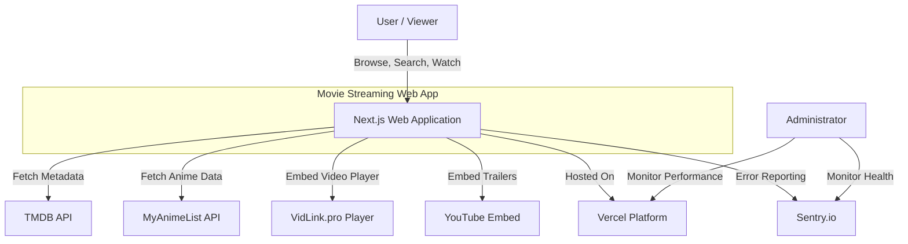
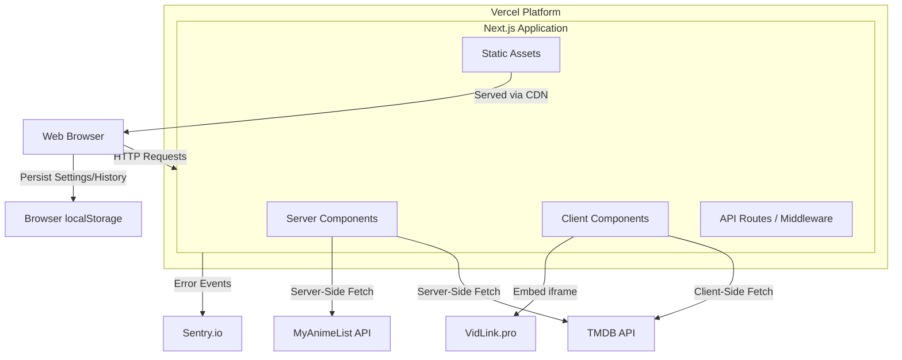
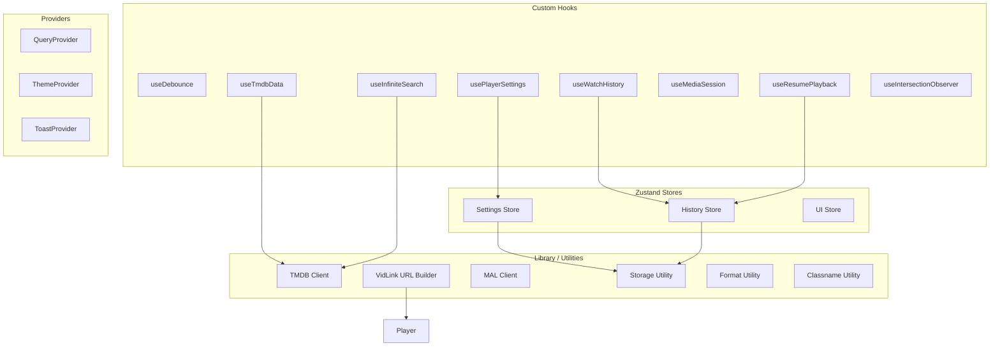
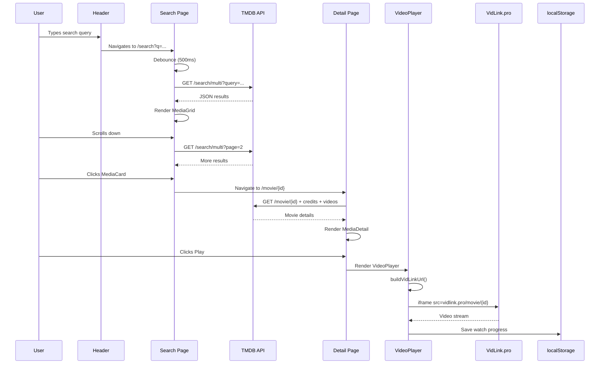
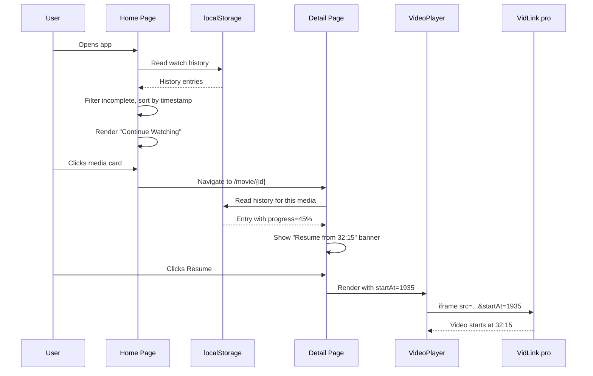
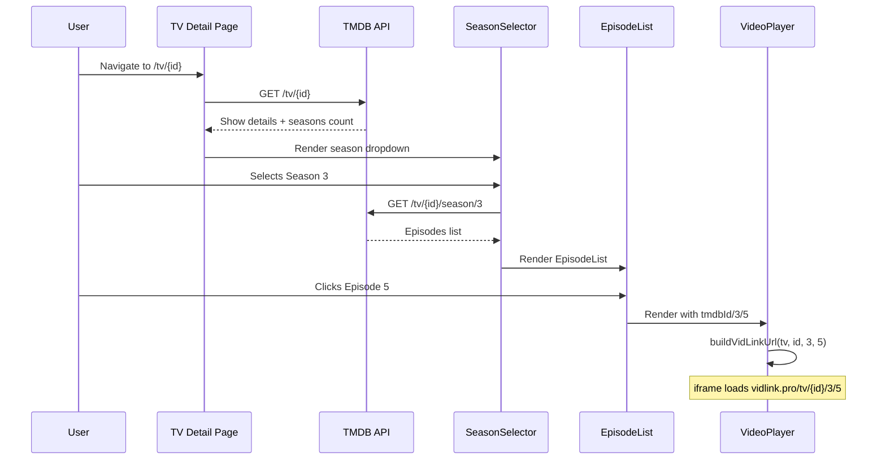
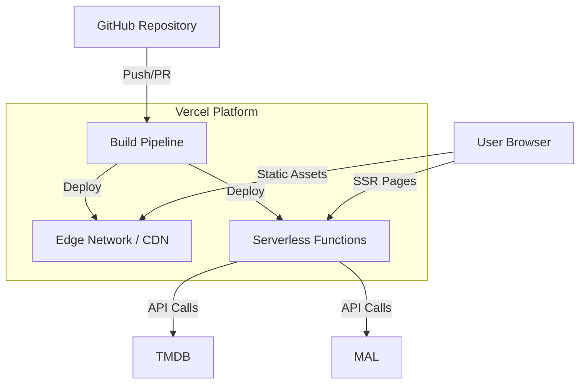

# Architecture Document
## Movie Streaming Web Application

**Version:** 1.0  
**Date:** June 20, 2026  
**Model:** C4 (Context, Container, Component, Code)  
**Status:** Approved

---

## 1. Context Diagram (Level 1)

The system context shows the application's scope and its interactions with external actors and systems.



**Actors:**
- **User:** Browses, searches, and watches content. No registration required.
- **Administrator:** Monitors system health via Sentry and Vercel Analytics dashboards.

**External Systems:**
- **TMDB API:** Provides movie/TV metadata, images, and search.
- **MyAnimeList API:** Provides anime metadata and episode data.
- **VidLink.pro:** Third-party video embedding service (iframe).
- **YouTube:** Trailer embeds (when available from TMDB).
- **Vercel:** Hosting platform with edge functions and analytics.
- **Sentry:** Error tracking and performance monitoring.

---

## 2. Container Diagram (Level 2)

The container diagram shows the high-level technical building blocks of the application.



**Containers:**

| Container | Technology | Responsibility |
|-----------|-----------|---------------|
| Server Components | Next.js RSC | SSR, data fetching, SEO metadata, initial page render |
| Client Components | React + Zustand | Interactive UI, state management, player embed, localStorage |
| API Routes / Middleware | Next.js Middleware | Security headers, CSP, rate limiting |
| Static Assets | Vercel CDN | Images, fonts, icons, manifest.json |
| Browser localStorage | Web Storage API | User preferences, watch history, search history |

---

## 3. Component Diagram (Level 3)

### 3.1 Application Layer Components

```mermaid
graph TB
    subgraph Pages[Pages - App Router]
        Home[Home Page]
        Search[Search Page]
        MovieDetail[Movie Detail Page]
        TVDetail[TV Detail Page]
        AnimeDetail[Anime Detail Page]
        GenrePage[Genre Browse Page]
    end

    subgraph Layout[Layout Components]
        Header[Header]
        Footer[Footer]
        MobileNav[Mobile Navigation]
        RootLayout[Root Layout]
    end

    subgraph Media[Media Components]
        MediaCard[MediaCard]
        MediaGrid[MediaGrid]
        MediaCarousel[MediaCarousel]
        MediaDetail[MediaDetail]
        PosterImage[PosterImage]
        GenreBadge[GenreBadge]
        RatingBadge[RatingBadge]
    end

    subgraph Player[Player Components]
        VideoPlayer[VideoPlayer]
        PlayerSettingsDrawer[PlayerSettingsDrawer]
        PlayerErrorFallback[PlayerErrorFallback]
    end

    subgraph TV[TV Components]
        SeasonSelector[SeasonSelector]
        EpisodeList[EpisodeList]
        EpisodeCard[EpisodeCard]
    end

    subgraph Anime[Anime Components]
        AnimeEpisodeList[Anime EpisodeList]
        SubDubToggle[SubDubToggle]
    end

    subgraph UI[UI Primitives]
        Button[Button]
        Card[Card]
        Input[Input]
        Select[Select]
        Modal[Modal]
        Drawer[Drawer]
        Skeleton[Skeleton]
        Spinner[Spinner]
        Toast[Toast]
        InfiniteScroll[InfiniteScroll]
        ErrorBoundary[ErrorBoundary]
    end

    Home --> MediaCarousel
    Search --> MediaGrid
    Search --> InfiniteScroll
    MovieDetail --> MediaDetail
    MovieDetail --> VideoPlayer
    TVDetail --> SeasonSelector
    TVDetail --> EpisodeList
    TVDetail --> VideoPlayer
    AnimeDetail --> AnimeEpisodeList
    AnimeDetail --> SubDubToggle
    AnimeDetail --> VideoPlayer
    GenrePage --> MediaGrid
```



### 3.2 Data & State Layer Components



---

## 4. Code Diagram (Level 4) — Key Interfaces

### 4.1 Type System

```typescript
// Core domain types
type MediaType = 'movie' | 'tv' | 'anime';

interface MediaItem {
  id: number;
  type: MediaType;
  title: string;
  posterUrl: string;
  backdropUrl?: string;
  rating: number;
  year?: number;
  genreIds: number[];
}

// TMDB response types
interface TMDBResponse<T> {
  page: number;
  results: T[];
  total_pages: number;
  total_results: number;
}

interface TMDBMovie {
  id: number;
  title: string;
  overview: string;
  poster_path: string | null;
  backdrop_path: string | null;
  release_date: string;
  vote_average: number;
  vote_count: number;
  genre_ids: number[];
  runtime?: number;
  tagline?: string;
  status?: string;
}

interface TMDBTVShow {
  id: number;
  name: string;
  overview: string;
  poster_path: string | null;
  backdrop_path: string | null;
  first_air_date: string;
  vote_average: number;
  genre_ids: number[];
  number_of_seasons: number;
  number_of_episodes: number;
  status: string;
}

interface TMDBEpisode {
  id: number;
  episode_number: number;
  name: string;
  overview: string;
  still_path: string | null;
  air_date: string;
  runtime: number | null;
  season_number: number;
}

// Player types
interface PlayerOptions {
  primaryColor?: string;
  secondaryColor?: string;
  icons?: 'vid' | 'default';
  iconColor?: string;
  title?: boolean;
  poster?: boolean;
  autoplay?: boolean;
  nextbutton?: boolean;
  player?: 'jw';
  startAt?: number;
  sub_file?: string;
  sub_label?: string;
  fallback_url?: string;
}

interface VideoPlayerProps {
  type: MediaType;
  tmdbId?: number;
  malId?: number;
  season?: number;
  episode?: number;
  subOrDub?: 'sub' | 'dub';
  options?: PlayerOptions;
  onProgress?: (progress: number) => void;
  onError?: (error: PlayerError) => void;
  className?: string;
}

// Store types
interface PlayerSettingsState {
  primaryColor: string;
  secondaryColor: string;
  icons: 'vid' | 'default';
  iconColor: string;
  autoplay: boolean;
  nextbutton: boolean;
  player: 'jw' | 'default';
  updateSetting: <K extends keyof PlayerSettingsState>(
    key: K,
    value: PlayerSettingsState[K]
  ) => void;
  resetToDefaults: () => void;
}

interface WatchHistoryEntry {
  id: string;
  mediaId: number;
  type: MediaType;
  title: string;
  posterUrl: string;
  timestamp: number;
  progress: number;
  completed: boolean;
  season?: number;
  episode?: number;
  subOrDub?: 'sub' | 'dub';
}
```

### 4.2 Key Utility: VidLink URL Builder

```typescript
// src/lib/vidlink.ts
function buildVidLinkUrl(props: VideoPlayerProps): string {
  const base = 'https://vidlink.pro';
  let url: string;

  switch (props.type) {
    case 'movie':
      url = `${base}/movie/${props.tmdbId}`;
      break;
    case 'tv':
      url = `${base}/tv/${props.tmdbId}/${props.season}/${props.episode}`;
      break;
    case 'anime':
      url = `${base}/anime/${props.malId}/${props.episode}/${props.subOrDub}?fallback=true`;
      break;
  }

  // Append PlayerOptions as query parameters
  const params = new URLSearchParams();
  if (props.options) {
    Object.entries(props.options).forEach(([key, value]) => {
      if (value !== undefined && value !== null) {
        params.set(key, String(value));
      }
    });
  }

  const separator = url.includes('?') ? '&' : '?';
  return params.toString() ? `${url}${separator}${params.toString()}` : url;
}
```

---

## 5. Technology Decisions

### 5.1 Next.js App Router over Pages Router

| Criterion | App Router | Pages Router |
|-----------|-----------|-------------|
| React Server Components | Native support | Not available |
| Streaming SSR | Built-in | Limited |
| Layout nesting | Composable layouts | `_app.tsx` only |
| Data fetching | `async` server components | `getServerSideProps` / `getStaticProps` |
| Bundle size | Smaller (server/client split) | Larger |
| Future-proof | Actively developed | Maintenance mode |

**Decision:** App Router. Server Components reduce client-side JavaScript, improve TTI, and simplify data fetching by colocating it with the components that render the data.

---

### 5.2 Zustand over Redux / Context

| Criterion | Zustand | Redux Toolkit | React Context |
|-----------|---------|--------------|---------------|
| Boilerplate | Minimal | Moderate | Low (but verbose for updates) |
| Performance | Selective re-renders | Selective re-renders | Re-renders all consumers |
| Persistence | Built-in middleware | Requires middleware | Manual implementation |
| DevTools | Browser extension | Excellent DevTools | None |
| Bundle size | ~1KB | ~12KB | 0KB (built-in) |
| TypeScript | Excellent | Excellent | Good |

**Decision:** Zustand. The app has 3 small stores (settings, history, UI). Zustand provides persistence middleware out of the box, has minimal boilerplate, and keeps bundle size small. Redux is overkill for this scale; Context causes unnecessary re-renders.

---

### 5.3 Tailwind CSS over CSS Modules / Styled-Components

| Criterion | Tailwind CSS | CSS Modules | Styled-Components |
|-----------|-------------|-------------|-------------------|
| Consistency | Design token system | Manual | Manual |
| Bundle size | Purged, ~10KB | Varies | Runtime overhead |
| Dark mode | `dark:` variant | Manual media queries | Manual |
| Responsive | `sm:`, `md:` prefixes | Manual breakpoints | Manual |
| Developer speed | Fast (utility classes) | Moderate | Moderate |
| Learning curve | Low (if familiar with CSS) | Low | Medium |

**Decision:** Tailwind CSS. Utility-first approach enables rapid prototyping and consistent design tokens. The `dark:` variant simplifies theming. Purging unused styles keeps bundle size minimal.

---

### 5.4 TanStack Query over SWR / Manual Fetching

| Criterion | TanStack Query | SWR | Manual fetch + useEffect |
|-----------|---------------|-----|-------------------------|
| Caching | Sophisticated | Good | Manual |
| Infinite scroll | Built-in | Built-in | Manual |
| Stale-while-revalidate | Built-in | Built-in | Manual |
| DevTools | Excellent | Good | None |
| Mutations | Built-in | Manual | Manual |
| TypeScript | Excellent | Good | N/A |
| Bundle size | ~15KB | ~5KB | 0KB |

**Decision:** TanStack Query. Infinite scroll for search results, sophisticated cache invalidation, and built-in loading/error states justify the slightly larger bundle size. The devtools are invaluable for debugging data fetching issues.

---

### 5.5 Streaming SSR vs Static Generation

| Strategy | Use Case | Chosen For |
|----------|---------|-----------|
| **SSR** (dynamic) | Personalized, frequently changing data | Homepage (trending), Search |
| **SSG** (static) | Infrequently changing, shared content | Genre pages |
| **ISR** | Semi-static with periodic updates | Detail pages (revalidate every hour) |

**Decision:** Hybrid approach.
- Homepage: SSR with short cache (trending changes frequently)
- Search: Client-side only (user-specific queries)
- Detail pages: ISR with 1-hour revalidation (metadata changes rarely)
- Genre pages: SSG at build time (genre lists are static)

---

## 6. Data Flow Diagrams

### 6.1 Search → Browse → Watch Flow



### 6.2 Resume Watching Flow



### 6.3 TV Episode Navigation Flow



---

## 7. Deployment Architecture



**Deployment Flow:**
1. Developer pushes code to GitHub
2. Vercel detects changes and triggers build
3. Next.js build generates static pages and serverless functions
4. Static assets deployed to Edge CDN
5. Serverless functions deployed to Vercel's runtime
6. Preview deployment URL generated for PRs
7. Production deployment on merge to `main`

---

## 8. Error Handling Strategy

### 8.1 Component-Level
- Every page wrapped in `ErrorBoundary` component
- `error.tsx` files in App Router for route-level error boundaries
- `PlayerErrorFallback` for iframe load failures

### 8.2 API-Level
- TanStack Query retry logic (3 attempts with exponential backoff)
- Stale-while-revalidate: show cached data while fetching fresh data
- Custom error types for API failures (rate limit, network, not found)

### 8.3 Storage-Level
- Safe localStorage wrapper with SSR guard (`typeof window !== 'undefined'`)
- `QuotaExceededError` handler: trim oldest history entries
- JSON parse error handler: reset to defaults on corrupt data

### 8.4 Global
- Sentry error tracking in production
- `window.onerror` and `unhandledrejection` handlers
- Structured error logging with context (page, user agent, timestamp)

---

## 9. Security Architecture

### 9.1 Content Security Policy

```
default-src 'self';
script-src 'self' 'unsafe-inline' https://vidlink.pro https://*.vercel-analytics.com;
style-src 'self' 'unsafe-inline';
img-src 'self' https://image.tmdb.org https://*.myanimelist.net data:;
frame-src https://vidlink.pro https://www.youtube.com;
connect-src 'self' https://api.themoviedb.org https://api.myanimelist.net https://vidlink.pro;
font-src 'self';
object-src 'none';
base-uri 'self';
form-action 'self';
```

### 9.2 Middleware Security Headers

| Header | Value | Purpose |
|--------|-------|---------|
| `X-Content-Type-Options` | `nosniff` | Prevent MIME type sniffing |
| `X-Frame-Options` | `DENY` | Prevent our app from being iframed |
| `Referrer-Policy` | `strict-origin-when-cross-origin` | Control referrer info |
| `Permissions-Policy` | `camera=(), microphone=(), geolocation=()` | Restrict browser features |

---

**Document End**
